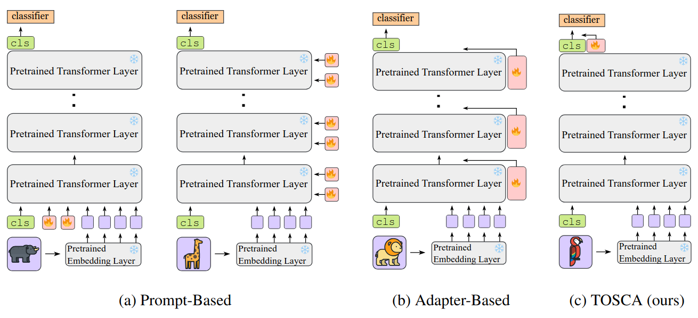
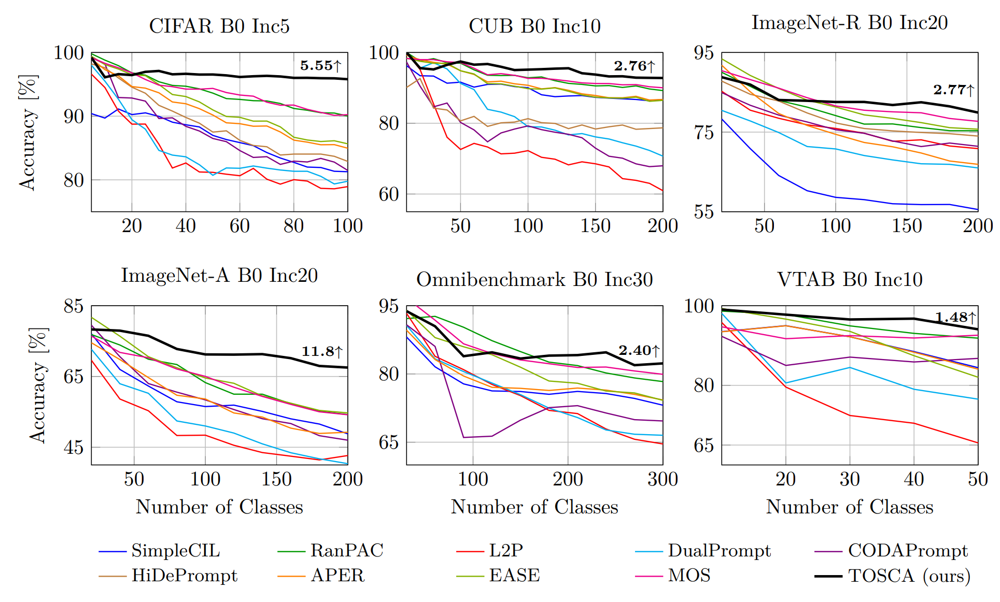

# Unlocking [CLS] Features for Continual Post-Training

<p align="center">
  <a href="https://openreview.net/forum?id=OWfWyj6krc"></a>
  <a href="https://arxiv.org/abs/2502.14762"></a>
  <a href="#-citation"></a>
</p>

<p align="center">
  <a href="#-introduction">🎉 Introduction</a> •
  <a href="#️-method">🏗️ Method</a> •
  <a href="#️-how-to-use">☄️ How to Use</a> •
  <a href="#-citation">📄 Citation</a>
</p>

> **Official PyTorch implementation of TOSCA**, accepted at *Transactions on Machine Learning Research (TMLR)* 2026.

---

## 🎉 Introduction

Continual learning requires models to integrate new classes or domains over time while preserving previously acquired knowledge. Within this paradigm, foundation models often achieve strong performance, but they still remain subject to the **stability–plasticity trade-off**, where excessive plasticity leads to forgetting of prior knowledge, and excessive stability constrains the adaptation.

To address this challenge, we introduce two key contributions:

- **LuCA** (*Learn and Calibrate*): A new parameter-efficient fine-tuning module that acquires task-specific knowledge through an **adapter–calibrator** couple, enabling well-refined feature representations.
- **TOSCA** (*Token-level Sparse Calibration and Adaptation*): For each task, a sparse LuCA module is deployed on top of the last classification token [CLS] just before the classifier.

By leaving the generalization capabilities of the frozen foundation model intact and adapting **exclusively via the last token**, TOSCA achieves a harmonious balance between stability and plasticity while reducing both training and inference complexity.

> 🏆 TOSCA achieves **state-of-the-art performance** while introducing **8× fewer parameters** compared to prior methods.

---

## 🏗️ Method

<p align="center">
  
</p>

The **LuCA** module consists of two branches applied to the [CLS] token:

- **Adapter**: a bottleneck MLP (`dim → dim/mlp_ratio → dim`) followed by LayerNorm, learning a task-specific residual.
- **Calibrator**: a Squeeze-and-Excitation block (`dim → dim/se_ratio → dim`) with a Sigmoid gate, recalibrating feature-wise responses.

In the full **TOSCA** flow, the adapter output is first normalized and residually added to the input, and then the calibrator gates the result — yielding a compact yet expressive adaptation of the [CLS] token representation.

At **inference time**, TOSCA selects the most relevant task-specific module via **entropy minimization** over stored per-task checkpoints, with no task-identity labels required.

<p align="center">
  
</p>

---

## ☄️ How to Use

### 🗂️ Dependencies

Install the required packages:

```bash
pip install torch torchvision timm numpy scipy pillow tqdm
```

### 📂 Dataset Preparation

TOSCA supports the following benchmarks:

| Dataset | Config file |
|---|---|
| CIFAR-100 | `exps/tosca_cifar.json` | 
| CUB-200 | `exps/tosca_cub.json` |
| ImageNet-A | `exps/tosca_ina.json` |
| ImageNet-R | `exps/tosca_inr.json` |
| OmniBenchmark | `exps/tosca_omni.json` |
| VTAB | `exps/tosca_vtab.json` |

For **CIFAR-100**, the dataset is downloaded automatically. For all other datasets, specify the data path in `utils/data.py`:

```python
def download_data(self):
    train_dir = '[DATA-PATH]/train/'
    test_dir = '[DATA-PATH]/val/'
```

### 🔑 Running Experiments

1. Select and (optionally) edit the config file for your target dataset.
2. Run training:

```bash
python main.py --config=./exps/tosca_[DATASET].json
```

Logs are saved to `logs/<model>/<dataset>/<init_cls>/<increment>/` and per-task TOSCA checkpoints to `tosca/task<i>.pth`.

### ⚙️ Hyperparameters

All hyperparameters are set in the corresponding JSON config file:

| Parameter | Description | Default |
|---|---|---|
| `init_cls` | Number of classes in the initial stage | varies |
| `increment` | Number of classes per subsequent stage | varies |
| `backbone_type` | Pre-trained ViT backbone from timm (`vit_base_patch16_224` / `vit_base_patch16_224_in21k`) | `vit_base_patch16_224_in21k` |
| `mlp_ratio` | Bottleneck ratio of the adapter MLP | `16` |
| `se_ratio` | Bottleneck ratio of the calibrator SE block | `16` |
| `l1` | L1 sparsity regularization coefficient | `0.0005` |
| `flow` | Module variant (`tosca`, `tosca_r`, `adapter`, `calibrator`) | `tosca` |
| `epochs` | Training epochs per incremental stage | `20` |
| `batch_size` | Batch size | `48` |
| `optimizer` | Optimizer (`sgd`, `adam`, `adamw`) | `sgd` |
| `scheduler` | LR scheduler (`cosine`, `steplr`, `constant`) | `cosine` |
| `lr` | Base learning rate | `0.025` |
| `weight_decay` | Weight decay | `0` |
| `milestones` | Epoch milestones for multi-step LR decay | `[10, 15]` |
| `seed` | Random seed for class order shuffling | `1993` |


## 🤗 Contact

If there are any questions, please feel free to open an issue or contact the author **M. Onur Yildirim** at [m.o.yildirim@tue.nl](mailto:m.o.yildirim@tue.nl). Enjoy the code!

---

## 📜 License

This project is released under the [MIT License](LICENSE).

## 📄 Citation

If you find this work useful, please cite:

```bibtex
@article{
yildirim2026unlocking,
title={Unlocking [{CLS}] Features for Continual Post-Training},
author={Murat Onur Yildirim and Elif Ceren Gok Yildirim and Joaquin Vanschoren},
journal={Transactions on Machine Learning Research},
issn={2835-8856},
year={2026},
url={https://openreview.net/forum?id=OWfWyj6krc},
note={}
}
```

## 🙏 Acknowledgements

We thank the following repository for providing helpful components and functions used in our work:

[LAMDA-PILOT](https://github.com/sun-hailong/LAMDA-PILOT) — a comprehensive continual learning benchmark toolbox.